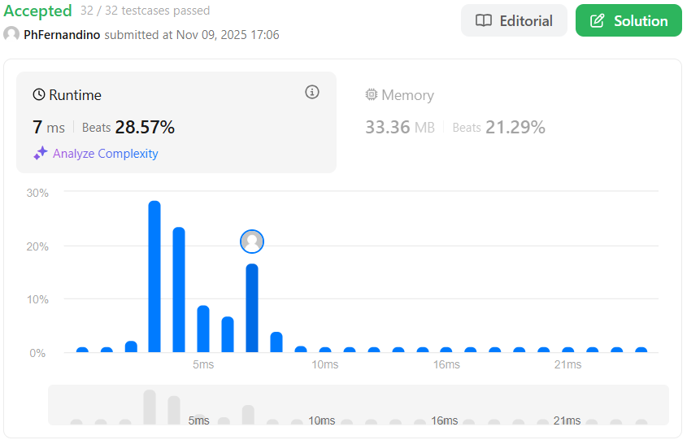
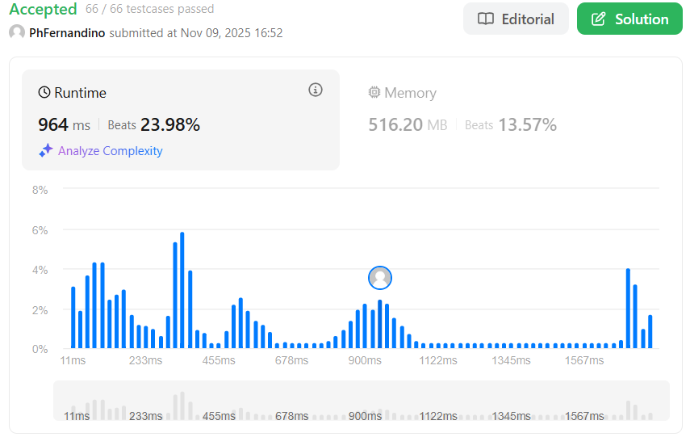
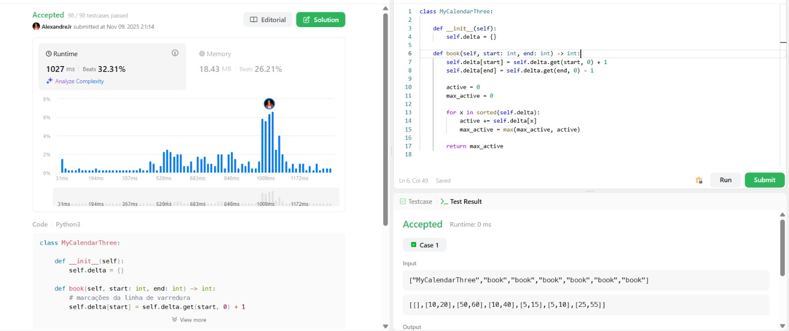
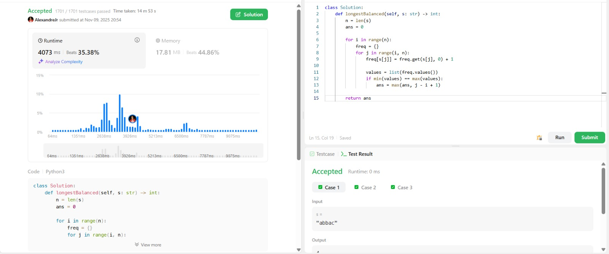

## Alunos  
| Matrícula | Nome |  
|-----------------------|---------------------|  
| 20/2015868 | Alexandre Lema Xavier Júnior |  
| 22/1031354| Pedro Henrique Fernandino da Silva |  

## Sobre 
Resolução de questões do LeetCode (2 difíceis e 2 médias) pelos integrantes do grupo com o objetivo de demonstrar o conhecimento adquirido nesse módulo (Árvores Balanceadas) da disciplina.

## Questões

|Questão | Dificuldade |
| -- | -- |
| [109. Convert Sorted List to Binary Search Tree](https://leetcode.com/problems/convert-sorted-list-to-binary-search-tree/description/)| Média |
| [315. Count of Smaller Numbers After Self](https://leetcode.com/problems/count-of-smaller-numbers-after-self/description/)| Difícil |
| [732. My Calendar III](https://leetcode.com/problems/my-calendar-iii/)| Difícil |
| [3713. Longest Balanced Substring I](https://leetcode.com/problems/longest-balanced-substring-i/description/)| Média |

### [109 - Média](https://leetcode.com/problems/convert-sorted-list-to-binary-search-tree/description/) 
O exercício “Convert Sorted List to Binary Search Tree” (LeetCode 109) pede para converter uma lista ligada ordenada em ordem crescente em uma árvore binária de busca (BST) balanceada, onde a diferença de altura entre as subárvores esquerda e direita de qualquer nó não ultrapasse 1.
A solução implementada em C++ utiliza a abordagem de conversão da lista ligada para um vetor, o que facilita o acesso direto aos elementos pelo índice. Em seguida, é aplicada uma construção recursiva da árvore, escolhendo sempre o elemento central do vetor como raiz da subárvore atual, garantindo assim o balanceamento natural da BST.

### [315 - Difícil](https://leetcode.com/problems/count-of-smaller-numbers-after-self/description/) 
O exercício "315. Count of Smaller Numbers After Self" do LeetCode pede para, dado um array de inteiros nums, retornar um novo array onde cada posição i contém a quantidade de números menores que nums[i] que aparecem à direita dele no vetor original.
A solução foi implementada com um Merge Sort modificado, utilizando a técnica de Dividir e Conquistar. Durante o processo de mesclagem (merge), é contabilizado quantos elementos do lado direito são menores que o elemento atual do lado esquerdo, essas contagens são acumuladas em um vetor auxiliar, permitindo determinar, para cada elemento, quantos números menores aparecem após ele, esse método tem complexidade O(n log n).

### [732. My Calendar III - Difícil](https://leetcode.com/problems/my-calendar-iii/description/) 
A questão pede uma estrutura capaz de registrar eventos e, após cada novo agendamento, informar quantos eventos estão simultaneamente sobrepostos em algum moment, o maior valor k de sobreposição. A solução faz isso usando a técnica de varredura por pontos: cada evento adiciona +1 no seu horário de início e -1 no seu horário de término. Depois, os horários registrados são ordenados e percorridos acumulando essas variações, o que permite identificar quantos eventos estão ativos em cada instante. O maior valor acumulado corresponde ao k-booking atual, que é retornado após cada chamada ao método book.

### [3713. Longest Balanced Substring I - Média](https://leetcode.com/problems/longest-balanced-substring-i/description/) 
A questão pede para identificar o comprimento do maior substring "balanceado" de uma string, ou seja, um trecho onde todos os caracteres distintos aparecem exatamente o mesmo número de vezes. Para resolver isso, percorri todos os substrings possíveis usando dois laços: um para definir o início e outro para expandir o final. Durante essa expansão, mantém-se um dicionário que registra a frequência de cada caractere no trecho atual. A cada atualização, as frequências são comparadas; se o menor e o maior valor forem iguais, o substring é balanceado e seu tamanho pode ser considerado para atualizar a resposta. Ao final, retorna-se o maior comprimento encontrado.

## Vídeo de explicação das Questões:

https://github.com/user-attachments/assets/073d57cb-69b4-4865-b571-150b138b6dc6

